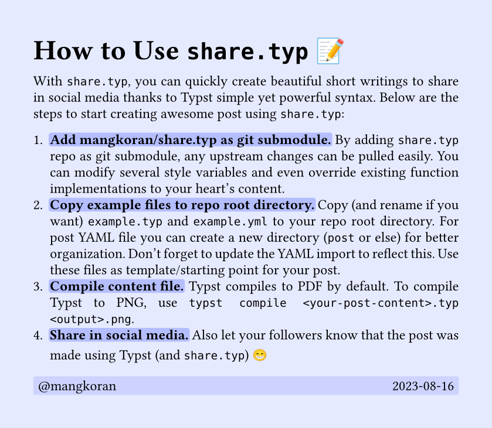

<h1 align="center">
  share.typ
</h1>

<p align="center">
  <a href="LICENSE">
    
  </a>
</p>

A template to create awesome short writings to share in social media thanks to
[Typst](https://github.com/typst/typst) simple yet powerful syntax.

## Demo

<div align="center">
  
</div>

## Usage

`share.typ` is intended to be used by importing `share.typ` file from a "content" file
([`example.typ`](example.typ) as example). This content file is used to call the functions which
apply document style & show post components and load post data from a YAML file
([`example.yml`](example.yml) as example). Inside the content file you can modify several style
variables and even override existing function implementations to your heart's content.

### With [Typst CLI](https://github.com/typst/typst) (Recommended)

The recommended usage with Typst CLI is by adding this `share.typ` repository as a [git
submodule](https://git-scm.com/book/en/v2/Git-Tools-Submodules). This way, upstream changes can be
pulled easily.

```
<your-post-repo>/
├── share.typ/ // git submodule 
|   └── share.typ
├── post/ // post YAML directory
|   ├── 01-post-one.yml
|   ├── 02-post-two.yml
|   └── ...
└── <your-post-content>.typ // #import "share.typ/share.typ": *
```

1. Add [mangkoran/share.typ](https://github.com/mangkoran/share.typ) as git submodule into your
   repo.
```
git submodule add https://github.com/mangkoran/share.typ
```
2. Copy and rename `example.typ` and `example.yml` to your repo root directory. For post YAML file
   you can create a new directory (`post` or else) for better organization. Don't forget to update
   the YAML import to reflect this. Use these files as template/starting point for your post.
3. Compile content file. Typst compiles to PDF by default. To compile Typst to PNG, use the
   following command.
```bash
typst compile <your-post-content>.typ <output>.png

# or you can use `watch` command to auto recompile on change 
# (a bit buggy tho especially with vi/vim/nvim)
typst watch <your-post-content>.typ <output>.png
```

### With [typst.app](https://typst.app)

1. Upload the [`share.typ`](share.typ), [`example.typ`](example.typ) and
   [`example.yml`](example.yml) files to your Typst project. You may rename `example.typ` and
   `example.yml`. For post YAML file you can create a new directory (`post` or else) for better
   organization. Don't forget to update the YAML import to reflect this.
2. Use `example.typ` and `example.yml` (or whatever the names after you rename it) as
   template/starting point for your post.
